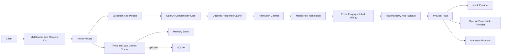
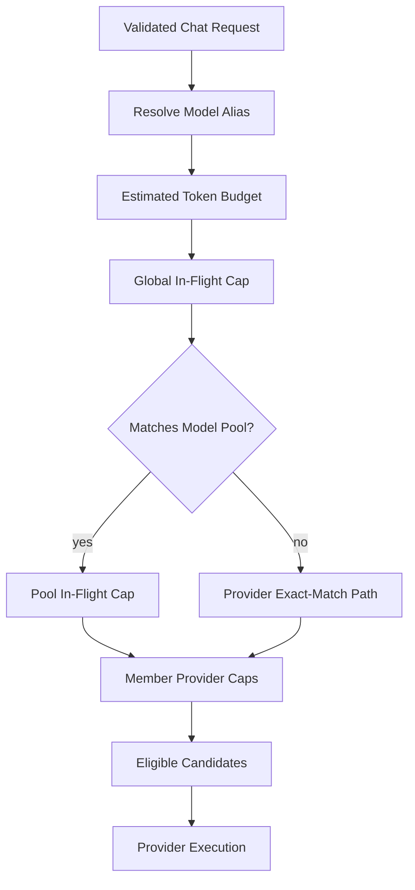
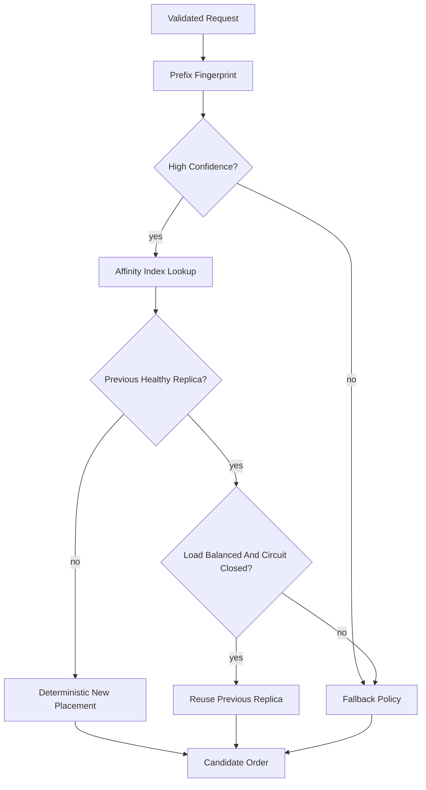

# Architecture

RustyGate is a small Rust inference gateway for learning and portfolio purposes. It demonstrates the shape of an AI infrastructure service without claiming production readiness.

## High-Level Architecture

## Request Lifecycle

1. Protected routes require `Authorization: Bearer`; with SQLite enabled, keys are looked up by prefix and verified with argon2 hashes. `/health` and `/ready` remain unauthenticated.
2. Global rate limits are checked before auth; per-key limits and per-key quotas are checked after auth.
3. The HTTP layer accepts OpenAI-compatible requests, with `/v1/responses` as the canonical modern surface and `/v1/chat/completions` retained for legacy clients.
4. The request gets a gateway request ID before validation so client-facing errors and logs can be correlated.
5. Request shape, body size, message count, and message content limits are validated.
6. Optional exact-match caching can return deterministic non-streaming responses before provider routing and records cache hit/miss metrics.
7. Configured model aliases are resolved before model-pool and provider eligibility checks.
8. If the resolved model matches a configured model pool, routing considers only that pool's member providers; otherwise it uses the provider-only exact-match path.
9. Admission control checks configured global, model-pool, provider, and estimated-token budgets before provider execution. Concurrency pressure is rejected cleanly instead of being hidden in an unbounded queue.
10. For `prefix_affinity`, RustyGate computes a privacy-preserving prefix fingerprint and consults the bounded process-local affinity index when the request has high-confidence reusable prefix material.
11. Routing orders candidates by the configured policy: `priority`, `cost`, `latency`, or `prefix_affinity`. Prefix affinity falls back to the configured fallback policy when prefix data is absent, the pool is single-member, load is imbalanced, or circuits are open.
12. Retryable provider failures are retried on the same provider with bounded backoff, then fall back to the next eligible provider.
13. Circuit breaker state skips open providers and allows half-open recovery probes after the cooldown.
14. Provider responses are normalized into OpenAI-shaped response types for non-streaming JSON or SSE streaming responses. Streaming paths record time to first token and enforce `gateway.stream_idle_timeout_ms` after the stream starts.
15. Metrics record latency, success/failure, provider attempts, prompt/completion token estimates, input/output cost estimates, in-flight load, TTFT, queue pressure, routing reasons, admission rejections, prefix-fingerprint outcomes, and stream outcomes in memory with bounded samples.
16. Structured request metadata logs record request ID, route, model, provider, status, latency, token estimates, cost estimate, fallback attempts, and classified error category without prompt content by default.
17. Optional SQLite persistence stores request logs, provider attempts, API keys, quota usage, and SQLite cache entries when enabled.
18. The client receives JSON or SSE responses without internal stack traces, provider raw errors, or secrets.

## Hardened Request Flow

## Model-Pool And Admission Flow

Model pools let one public model surface represent multiple configured replicas without treating each replica as an unrelated provider fallback. Admission control runs before provider execution so overload is explicit and bounded.

Concurrency caps return temporary admission errors with `Retry-After`. Estimated token-budget failures are invalid requests because the configured gateway policy rejects the request size before routing.

## Prefix-Aware Routing Flow

The affinity index stores hashed fingerprints and provider names only. It can improve placement locality for repeated-prefix traffic, but it does not prove that a runtime retained or reused KV-cache blocks.

## Module Responsibilities

- `src/routes`: HTTP endpoints and route-level response wiring, including compatibility resource endpoints.
- `src/models`: API request/response structs and validation for chat, Responses, model discovery, and stats.
- `src/compat.rs`: shared OpenAI-compatible public ID and timestamp helpers.
- `src/providers`: async provider trait, mock provider, OpenAI-compatible provider, and Anthropic provider.
- `src/routing`: model-pool indexing, admission control, prefix-affinity state, provider selection, retries, and fallback.
- `src/auth`: hashed API key storage, role checks, and quota accounting.
- `src/cache`: exact-match and experimental semantic response caching.
- `src/telemetry`: in-memory metrics and safe request metadata models.
- `src/storage`: memory storage plus optional SQLite request log persistence.
- `src/config.rs`: TOML configuration and safe local defaults.
- `src/error.rs`: structured errors and HTTP mappings.

## Provider Abstraction

Provider-specific details stay behind an async provider trait. Route handlers do not know whether a request goes to a mock provider, OpenAI-compatible API, Anthropic API, local vLLM server, or LM Studio.

The provider contract supports provider name, exact-model matching, async chat completion, and streaming chat completion. The Responses route maps onto this contract so it can reuse routing, retries, fallback, and circuit breakers. Other OpenAI resource endpoints currently expose lightweight compatibility shapes and can grow provider-specific execution paths as needed.

## Routing And Fallback Flow

The default routing strategy stays simple and predictable:

1. Require the request to include `model`.
2. Resolve configured model aliases.
3. Resolve matching model pools before falling back to provider-only exact model matching.
4. Apply admission caps for the relevant global, pool, and provider scopes.
5. Sort matching providers by configured `priority`, `cost`, `latency`, or `prefix_affinity` policy with deterministic tie breakers.
6. For prefix affinity, prefer a recent healthy provider for the same hashed prefix only while load remains balanced; otherwise use the configured fallback policy.
7. Skip providers whose circuit is open.
8. Try the first eligible provider.
9. For retryable failures, retry the same provider according to the configured retry policy, then fall back to the next eligible provider.
10. Stop immediately for non-retryable provider errors.
11. Return `503` when no provider can serve the request.

## Metrics Flow

Metrics should be updated after each request attempt and after the final request outcome. Runtime gauges and bounded samples remain in memory with small, obvious data structures.

Track total requests, successes, failures, in-flight requests, latency, selected provider, fallback attempts, provider error categories, prompt/completion tokens, input/output estimated cost, provider-level latency, provider in-flight counts, TTFT, queue pressure, admission rejection reasons, routing decision reasons, prefix-fingerprint outcomes, stream outcomes, and stream duration.

Request metadata logging is wired with structured `tracing` fields and optional SQLite persistence. Startup, HTTP, request, cache, and provider-attempt logs avoid prompt content by default. OpenTelemetry export is optional and configured through `[telemetry]`.

## Security Considerations

- Do not log API keys, Authorization headers, or prompt content by default.
- Do not return provider raw errors directly to clients.
- Keep `.env` ignored.
- Use request IDs for debugging without exposing sensitive payloads.
- Make full prompt logging an explicit local-development-only option.
