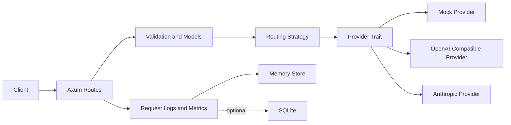

# Architecture

RustyGate is a small Rust inference gateway for learning and portfolio purposes. It demonstrates the shape of an AI infrastructure service without claiming production readiness.

## High-Level Architecture

## Request Lifecycle

1. The HTTP layer accepts a simplified OpenAI-compatible chat completion request.
2. The request gets a gateway request ID before validation so client-facing errors and logs can be correlated.
3. Request shape and message content are validated.
4. Routing picks providers by required exact model match and priority.
5. Provider responses are normalized into internal response types.
6. Fallback logic handles retryable provider failures by trying the next eligible provider (no same-provider retry in MVP).
7. Metrics record latency, success/failure, provider attempts, prompt/completion token estimates, and input/output cost estimates in memory with bounded latency samples.
8. Structured request metadata logs record request ID, route, model, provider, status, latency, token estimates, cost estimate, fallback attempts, and classified error category without prompt content by default.
9. Optional SQLite persistence stores request logs and provider attempts when enabled.
10. The client receives JSON responses without internal stack traces, provider raw errors, or secrets.

## Module Responsibilities

- `src/routes`: HTTP endpoints and route-level response wiring.
- `src/models`: API request/response structs and validation.
- `src/providers`: async provider trait, mock provider, OpenAI-compatible provider, and Anthropic provider.
- `src/routing`: provider selection, retries, and fallback.
- `src/telemetry`: in-memory metrics and safe request metadata models.
- `src/storage`: memory storage plus optional SQLite request log persistence.
- `src/config.rs`: TOML configuration and safe local defaults.
- `src/error.rs`: structured errors and HTTP mappings.

## Provider Abstraction

Provider-specific details stay behind an async provider trait. Route handlers do not know whether a request goes to a mock provider, OpenAI-compatible API, Anthropic API, local vLLM server, or LM Studio.

The provider contract supports provider name, exact-model matching, and async chat completion. Optional health/status checks can come later.

## Routing And Fallback Flow

The MVP should use simple priority routing:

1. Require the request to include `model`.
2. Filter providers by exact model match.
3. Sort matching providers by configured priority.
4. Try the first provider.
5. For retryable failures, fall back to the next eligible provider without retrying the same provider.
6. Stop immediately for non-retryable provider errors.
7. Return `503` when no provider can serve the request.

## Metrics Flow

Metrics should be updated after each request attempt and after the final request outcome. Keep the first version in memory with small, obvious data structures.

Track total requests, successes, failures, latency, selected provider, fallback attempts, prompt/completion tokens, input/output estimated cost, and provider-level latency.

Request metadata logging is wired with structured `tracing` fields and optional SQLite persistence. Startup, HTTP, and request logs avoid prompt content by default.

## Security Considerations

- Do not log API keys, Authorization headers, or prompt content by default.
- Do not return provider raw errors directly to clients.
- Keep `.env` ignored.
- Use request IDs for debugging without exposing sensitive payloads.
- Make full prompt logging an explicit local-development-only option.
