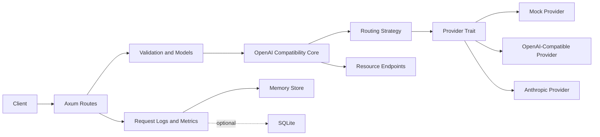

# Architecture

RustyGate is a small Rust inference gateway for learning and portfolio purposes. It demonstrates the shape of an AI infrastructure service without claiming production readiness.

## High-Level Architecture

## Request Lifecycle

1. Protected routes require `Authorization: Bearer` using the configured gateway API key; `/health` and `/ready` remain unauthenticated.
2. In-memory global and per-key rate limits are checked before protected route handlers run.
3. The HTTP layer accepts OpenAI-compatible requests, with `/v1/responses` as the canonical modern surface and `/v1/chat/completions` retained for legacy clients.
4. The request gets a gateway request ID before validation so client-facing errors and logs can be correlated.
5. Request shape, body size, message count, and message content limits are validated.
6. Configured model aliases are resolved before provider eligibility checks.
7. Routing picks providers by exact model match and the configured policy: `priority`, `cost`, or `latency`.
8. Retryable provider failures are retried on the same provider with bounded backoff, then fall back to the next eligible provider.
9. Circuit breaker state skips open providers and allows half-open recovery probes after the cooldown.
10. Provider responses are normalized into OpenAI-shaped response types for non-streaming JSON or SSE streaming responses.
11. Metrics record latency, success/failure, provider attempts, prompt/completion token estimates, and input/output cost estimates in memory with bounded latency samples.
12. Structured request metadata logs record request ID, route, model, provider, status, latency, token estimates, cost estimate, fallback attempts, and classified error category without prompt content by default.
13. Optional SQLite persistence stores request logs and provider attempts when enabled.
14. The client receives JSON or SSE responses without internal stack traces, provider raw errors, or secrets.

## Module Responsibilities

- `src/routes`: HTTP endpoints and route-level response wiring, including compatibility resource endpoints.
- `src/models`: API request/response structs and validation for chat, Responses, model discovery, and stats.
- `src/compat.rs`: shared OpenAI-compatible public ID and timestamp helpers.
- `src/providers`: async provider trait, mock provider, OpenAI-compatible provider, and Anthropic provider.
- `src/routing`: provider selection, retries, and fallback.
- `src/telemetry`: in-memory metrics and safe request metadata models.
- `src/storage`: memory storage plus optional SQLite request log persistence.
- `src/config.rs`: TOML configuration and safe local defaults.
- `src/error.rs`: structured errors and HTTP mappings.

## Provider Abstraction

Provider-specific details stay behind an async provider trait. Route handlers do not know whether a request goes to a mock provider, OpenAI-compatible API, Anthropic API, local vLLM server, or LM Studio.

The provider contract supports provider name, exact-model matching, async chat completion, and streaming chat completion. The Responses route maps onto this contract so it can reuse routing, retries, fallback, and circuit breakers. Other OpenAI resource endpoints currently expose lightweight compatibility shapes and can grow provider-specific execution paths as needed.

## Routing And Fallback Flow

The default routing strategy stays simple and predictable:

1. Require the request to include `model`.
2. Resolve configured model aliases.
3. Filter providers by exact model match.
4. Sort matching providers by configured `priority`, `cost`, or `latency` policy with deterministic tie breakers.
5. Skip providers whose circuit is open.
6. Try the first eligible provider.
7. For retryable failures, retry the same provider according to the configured retry policy, then fall back to the next eligible provider.
8. Stop immediately for non-retryable provider errors.
9. Return `503` when no provider can serve the request.

## Metrics Flow

Metrics should be updated after each request attempt and after the final request outcome. Keep the first version in memory with small, obvious data structures.

Track total requests, successes, failures, in-flight requests, latency, selected provider, fallback attempts, provider error categories, prompt/completion tokens, input/output estimated cost, and provider-level latency.

Request metadata logging is wired with structured `tracing` fields and optional SQLite persistence. Startup, HTTP, request, and provider-attempt logs avoid prompt content by default.

## Security Considerations

- Do not log API keys, Authorization headers, or prompt content by default.
- Do not return provider raw errors directly to clients.
- Keep `.env` ignored.
- Use request IDs for debugging without exposing sensitive payloads.
- Make full prompt logging an explicit local-development-only option.
